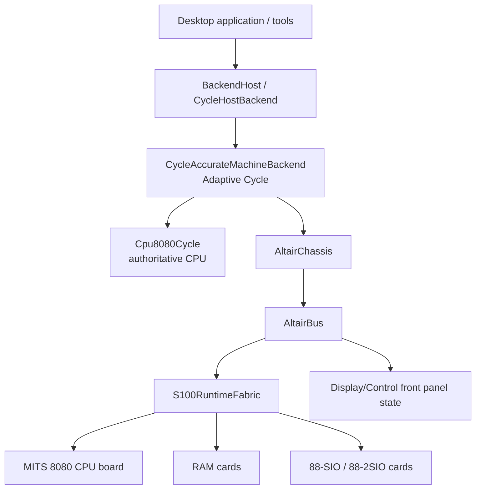
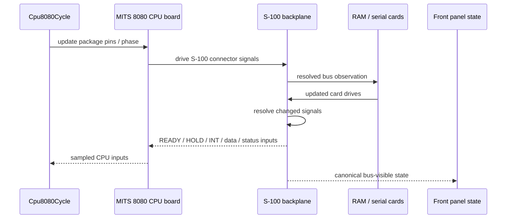
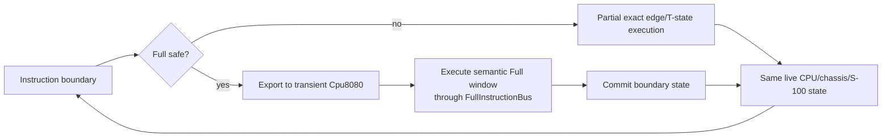
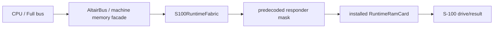
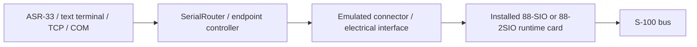
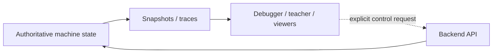

# RusTair Emulation Architecture

This document describes the current production architecture of RusTair as a machine model, not as a historical record of older implementations.

It is written for developers who need to understand **why the code is divided the way it is**, which object owns each piece of state, and how one emulated T-state or accelerated Full window flows through the system.

---

## 1. Architectural objective

RusTair models an Altair 8800 as a collection of physical components connected by a system bus:



The software architecture should preserve these hardware boundaries wherever they affect observable behavior.

The most important consequence is:

> Cards communicate through the S-100 bus model, not through invented direct calls between card implementations.

---

## 2. Layered view

### Layer 1 — Application and host integration

Primary code: `src/app/`, `src/io/`, `src/audio.rs`.

Responsibilities:

- create the desktop GUI;
- convert wall-clock time to guest execution budget;
- route user controls to the backend;
- display snapshots/history;
- manage host TCP/COM endpoints;
- manage persisted settings and migration;
- play presentation/peripheral audio.

This layer is not allowed to own duplicate CPU, RAM or UART state.

### Layer 2 — Backend contract and scheduling facade

Primary code: `src/backend/mod.rs`, `src/backend/cycle_host.rs`.

Responsibilities:

- expose a stable machine API to the app/debugger;
- report capabilities;
- manage host-facing run/step/debug policy;
- expose snapshots and controlled inspection/mutation operations;
- bridge host elapsed time that must advance independent serial clocks.

`BackendHost` is the application's entry point. The concrete machine is the Adaptive Cycle backend.

### Layer 3 — Adaptive Cycle execution

Primary code: `src/backend/cycle.rs`, `src/backend/cycle/partial_impl.rs`, `src/backend/cycle/full.rs`.

Responsibilities:

- decide whether the next execution interval can run in Full;
- otherwise execute exact Partial timing;
- transfer CPU state into/out of the transient semantic executor at proven boundaries;
- keep the physical chassis/cards synchronized;
- record Full/Partial metrics when measurement is enabled.

### Layer 4 — Exact 8080 and CPU-board boundary

Primary code: `src/cpu8080_cycle/`, `src/machine/cpu_board.rs`, `src/s100_cpu.rs`.

Responsibilities:

- exact 8080 machine-cycle/T-state/clock-edge sequencing;
- package pin state;
- READY/HOLD/interrupt/reset/halt behavior;
- translation between 8080 package behavior and the MITS CPU board's S-100 connector behavior.

### Layer 5 — Altair chassis and front panel

Primary code: `src/machine/`.

Responsibilities:

- physical machine container and power/control state;
- front-panel switches and Display/Control behavior;
- canonical bus-visible state used by the panel;
- memory/serial facades that reach the live S-100 inventory;
- diagnostic metering and inspection hooks that do not create a second machine.

### Layer 6 — S-100 electrical runtime

Primary code: `src/s100*.rs`, `src/s100/` if present, card adapters.

Responsibilities:

- physical signal vocabulary and connector roles;
- backplane insertion and drive resolution;
- High-Z/open-collector/contention semantics;
- static topology/decode acceleration;
- live CPU/RAM/serial card instances.

---

## 3. State ownership

There must be one authoritative owner for each real emulated state domain.

| State | Authority | Important non-authorities |
| --- | --- | --- |
| 8080 registers/flags/PC/SP | `Cpu8080Cycle` at synchronization boundaries | UI snapshots, instruction history |
| INTE / HALT / exact CPU timing | `Cpu8080Cycle` | semantic decoder, GUI |
| exact package pins | `Cpu8080Cycle` | pin diagram UI |
| chassis power | `AltairChassis` | configuration object |
| RUN/STOP physical latch | `S100BusState::signals.run` | GUI RUN button state |
| raw S-100 electrical state | live bus/backplane state | LED brightness, teacher history |
| RAM bytes | installed runtime RAM card(s) in `S100RuntimeFabric` | debugger copies, Full cache |
| RAM protection/wait/decode state | physical runtime RAM configuration/card state | aggregate legacy settings |
| serial UART/card state | installed runtime serial-card instance | terminal/TCP/COM buffers |
| S-100 hardware inventory | mounted `S100RuntimeFabric` derived from validated `S100HardwareConfig` | old aggregate migration fields |
| Full semantic registers | transient `Cpu8080` while a Full window is active | never persistent outside the window |
| visible lamp persistence | UI/presentation integrator | never hardware authority |

This table is a design rule, not only documentation. Architecture tests defend several of these boundaries.

---

## 4. Exact Partial execution

Partial is the low-level reference path.

A simplified conceptual flow for one electrically relevant edge is:



The implementation is optimized with cached drives/deltas, but semantically this is still one physical network. The backplane itself must not know that a given slot is RAM or a serial card.

### Exact clock model

`Cpu8080Cycle` recognizes the 8080 machine cycles and T-states. A T-state can be decomposed into four digital edges:

```text
Phi1Rising -> Phi1Falling -> Phi2Rising -> Phi2Falling
```

This allows hardware-sensitive signals to change or be sampled at the correct edge rather than only at instruction boundaries.

---

## 5. Full execution

Full exists to avoid redundant host work while keeping the same physical result at all required observation/synchronization points.

### 5.1 Entry

A Full window can start only at a clean instruction boundary and only if the chassis/hardware state is safe. Blockers include conditions such as:

- unsupported chassis state;
- active serial timing that requires exact intermediate observation;
- READY low;
- HOLD;
- pending interrupt under the relevant INTE condition;
- RESET;
- CPU fault/stop-wait state;
- insufficient execution budget;
- unsupported opcode/barrier.

The exact list is encoded by the Full admission/blocker logic; documentation should not be used as a substitute for reading those predicates when changing them.

### 5.2 State export

`Cpu8080Cycle::begin_full_execution_window` creates a transient instruction-level `Cpu8080` and exports architectural state such as registers, PC, SP, flags, INTE and elapsed cycles.

No physical RAM or card state is copied.

### 5.3 FullInstructionBus

The semantic CPU still performs memory/stack operations through a `Bus` implementation, `FullInstructionBus`. This layer:

- reaches bus-owned physical RAM/card storage;
- projects the correct external machine-cycle semantics;
- preserves exact T-state totals;
- accounts for front-panel duty/activity;
- handles memory protection and cache invalidation;
- retains the final physical cycle required for boundary re-entry;
- implements special exact handling such as stale-sMEMR T1 behavior;
- places exact INTE transitions for supported DI and the guarded EI→LHLD case.

The semantic core is therefore not allowed to call a RAM vector directly.

### 5.4 Exit

At the synchronization boundary:

1. Full panel activity is committed/merged.
2. The retained final machine-cycle/pin state is reconstructed.
3. `commit_full_execution_window` imports CPU architectural state into `Cpu8080Cycle`.
4. The physical CPU-board boundary is marked/reconciled so the next Partial edge resumes the same machine rather than a fabricated state.

### 5.5 Special guarded EI → LHLD

Generic `EI` is not simply declared Full-safe. Production contains a narrow guarded optimization for the measured EI→LHLD sequence when the safety predicate proves the delayed interrupt-enable edge can be placed exactly and the pair cannot become an unsafe Full→Partial presentation boundary.

If the preconditions do not hold, Partial handles EI.

This is a useful example of RusTair's performance philosophy: **specialization is accepted only when the equivalence argument is explicit and testable**.

---

## 6. Full and Partial relationship



Partial is not a fallback implementation with a different machine. Full is not a second backend. They alternate over a single authoritative machine.

---

## 7. CPU semantic core versus exact cycle core

RusTair contains two 8080 representations for different jobs:

### `Cpu8080` (`src/cpu8080.rs`)

- instruction-level semantic executor;
- compact programmer-visible register state;
- uses a `Bus` trait;
- suitable for executing whole instructions quickly;
- used transiently by Full and by semantic/reference tests;
- does not itself represent the full physical Altair CPU board timeline.

### `Cpu8080Cycle` (`src/cpu8080_cycle/`)

- authoritative exact CPU state at synchronization boundaries;
- machine cycles and T-states;
- PHI1/PHI2 edge ordering;
- pins and hardware-sensitive timing;
- READY/HOLD/interrupt/reset/halt behavior;
- import/export bridge for Full windows.

Do not merge these concepts casually. Their coexistence is deliberate: one expresses instruction semantics efficiently; the other expresses the hardware timeline.

---

## 8. MITS CPU board

The 8080 package is not itself the S-100 bus. The MITS CPU board contains board-level behavior that translates processor package signals into system-bus status/control/data behavior.

RusTair separates:

- CPU core/package timing (`cpu8080_cycle`);
- CPU-board integration (`machine/cpu_board.rs` and `s100_cpu.rs`);
- generic S-100 resolution (`s100_backplane.rs`).

This keeps board-specific logic out of the generic CPU and keeps card-family knowledge out of the backplane.

---

## 9. S-100 electrical architecture

### Signals and contacts

`src/s100.rs` maps modeled S-100 signals to historical edge-connector pins and defines contact roles such as input, output, tri-state and open-collector.

### Generic card interface

`src/s100_interface.rs` re-exports the canonical bus-facing contract. A CPU board, RAM card and serial card use the same type of electrical interface.

### Backplane

`src/s100_backplane.rs` is intentionally card-agnostic. It stores card drives and resolves the electrical result.

Important concepts:

- High-Z means a card releases a line.
- Open-collector outputs may pull low but do not drive high.
- Multiple drivers may agree or contend.
- resolved level can therefore be true, false, floating/unknown or contended depending on the modeled net.

### Static decoder acceleration

A physical card's address straps do not change on every CPU edge. RusTair compiles fixed topology into responder masks/tables in `S100RuntimeFabric` and `S100IoDecodeIndex`.

This is an optimization of the physical decoder, not a shortcut around the card. Multiple matching responders remain possible and must still participate electrically.

---

## 10. Physical hardware inventory

`S100HardwareConfig` describes the desired physical chassis/card installation. `S100RuntimeFabric` validates/materializes it into live card objects.

Rules:

- the chassis model determines usable connector positions;
- one installed CPU board is required by the current production system;
- RAM and serial card config includes physical board/strap properties;
- moving physical cards requires POWER OFF;
- configuration is not runtime hardware until mounted;
- migration-only aggregate settings must not create a second topology.

---

## 11. Memory architecture

The memory path has several layers because it must serve physical execution and safe host inspection without duplicating RAM.



The debugger/RAM viewer may use inspection handles to read the same card storage without pretending that a guest bus transaction occurred. That distinction is intentional:

- **guest execution** must follow bus/card semantics;
- **host inspection** may inspect authoritative card state directly, but must not alter guest-visible timing unless performing an explicit debugger mutation operation.

Protection, population, decode overlap and wait-state configuration belong to the physical RAM/card model.

---

## 12. Serial architecture

The emulated card and host endpoint are separate.



The card owns guest-visible UART state and timing. Endpoint buffers and network/COM objects are host-side concerns.

Serial timing can continue even when useful CPU execution is STOPped, RESET-held or parked by HOLD. The host scheduler accounts for elapsed hardware time without turning the panel/UI into a second timing authority.

---

## 13. Front panel

### Physical controls

`FrontPanelController` and chassis/bus code implement switch/control operations. RUN/STOP, RESET, EXAMINE, DEPOSIT and PROTECT ultimately affect physical machine state.

### Raw state

`S100BusState` is the canonical raw front-panel/bus state. It is not reconstructed from GUI lamps.

### Full panel duty

Full execution cannot simply set lamps to the final instruction state. It accumulates equivalent bus-derived duty for the ADDRESS/DATA/STATUS/INTE/PROT presentation model and retains the correct final physical cycle for exact re-entry.

### Visual persistence

UI lamp brightness is a display effect. It is derived from physical activity and never fed back to the machine.

---

## 14. Debugger/observer architecture

Observers are deliberately downstream from the machine:



A debugger control such as DEPOSIT, breakpoint stop, or memory mutation is an explicit operation through the backend. Merely opening a viewer must not change emulation.

Instruction history, inferred call stack and loop detection are interpretations of retained observations and may be incomplete. They are not a hidden CPU model.

---

## 15. Application/UI architecture

`RusTairApp` owns application orchestration. It stores:

- `AppConfig`;
- `BackendHost`;
- serial router and host endpoint states;
- ASR-33/text-terminal controller state;
- audio engine;
- UI assets and presentation state;
- execution clock bookkeeping.

It does not contain architectural CPU registers or a second memory array.

`runtime.rs` implements the eframe update loop. `ui/` modules draw tools and panels. Controllers contain application logic that should not be embedded in drawing code when it affects workflows.

---

## 16. Configuration architecture

Configuration is separated into typed domains:

- machine/chassis/global machine preferences;
- slot-native S-100 hardware;
- RAM card profiles;
- 88-SIO properties;
- 88-2SIO straps;
- electrical interface choices;
- terminal/host endpoint preferences.

Persistence is implemented at application level because it must migrate historical configuration formats. Runtime hardware always uses the validated current model.

---

## 17. Dependency direction

A useful conceptual dependency rule is:

```text
UI / app
   ↓
backend public contract
   ↓
Adaptive execution + exact CPU
   ↓
machine/chassis integration
   ↓
S-100 electrical runtime/cards
```

Some low-level utility types are shared upward for snapshots/configuration, but emulation authority should not reverse direction. In particular:

- low-level hardware must not depend on egui;
- S-100 cards must not depend on app controllers;
- CPU semantics must not know which concrete serial card is installed;
- the backplane must not branch on card family;
- the UI must not mutate internal card state behind the backend's control boundary.

---

## 18. Performance boundaries

Current safe optimization mechanisms include:

- event/delta-based bus recomputation;
- cached connector drives;
- static address/I/O responder tables;
- Full read caches tied to physical invalidation;
- no-PROTECT fast path when topology proves it;
- marginal front-panel duty accumulation;
- multi-instruction Full windows;
- forced inlining of the hottest machine-cycle projection path.

These mechanisms are acceptable because they reduce host work while preserving the physical contract. Every new optimization should be reviewed in the same terms.

---

## 19. Architecture review checklist

Before approving a structural change, answer all of these:

- Does it introduce a second CPU, RAM, UART or RUN latch?
- Can a card now reach another card without the S-100 bus?
- Can the UI/presentation state influence raw machine state?
- Does Full still have an exact re-entry state?
- Can READY/HOLD/interrupt timing still be observed at the correct point?
- Are High-Z, open bus and overlapping decoders preserved?
- Does a host-speed option accidentally change modeled hardware time?
- Does persistence reconstruct exactly one physical runtime topology?
- Are debugger direct-inspection APIs clearly separated from guest transactions?
- Are new optimizations proven against Partial or another authoritative oracle?

If any answer is uncertain, treat the change as an architecture/fidelity change and add focused tests before merging.
