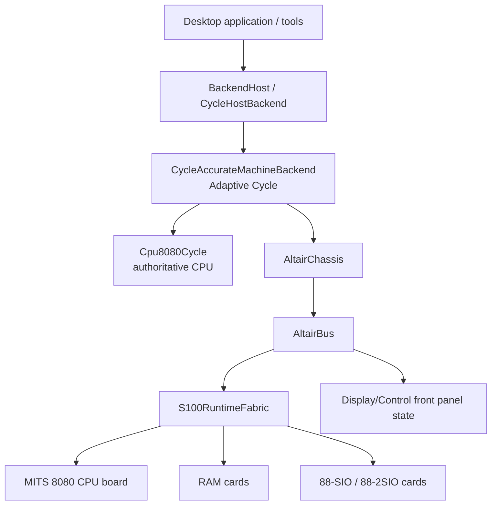
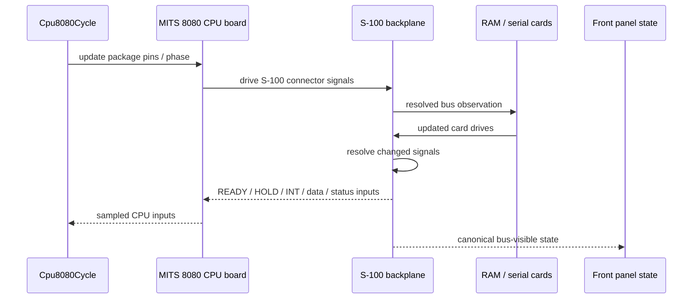
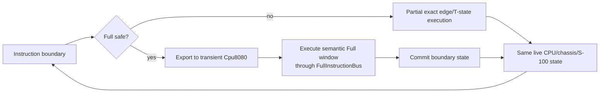
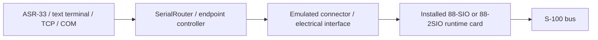
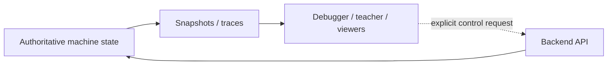

# RusTair Emulation Architecture

This document describes the current production architecture of RusTair as a machine model, not as a historical record of older implementations.

It is written for developers who need to understand **why the code is divided the way it is**, which object owns each piece of state, and how exact execution, accelerated Full windows and independently clocked peripherals coexist.

---

## 1. Architectural objective

RusTair models an Altair 8800 as a collection of physical components connected by a system bus:



The software architecture preserves these hardware boundaries wherever they affect observable behavior.

The most important consequence is:

> Cards communicate through the S-100 bus model, not through invented direct calls between card implementations.

---

## 2. Layered view

### Layer 1 — Application and host integration

Primary code: `src/app/`, `src/io/`, `src/audio.rs`.

Responsibilities:

- create the desktop GUI;
- convert wall-clock time to guest CPU execution budget;
- schedule independently clocked serial physical time;
- route user controls to the backend;
- display snapshots/history;
- manage host TCP/COM endpoints;
- manage persisted settings and migration;
- play presentation/peripheral audio.

This layer is not allowed to own duplicate CPU, RAM or UART state.

### Layer 2 — Backend contract and scheduling facade

Primary code: `src/backend/mod.rs`, `src/backend/cycle_host.rs`.

Responsibilities:

- expose a stable machine API to the app/debugger;
- report capabilities;
- manage host-facing run/step/debug policy;
- expose snapshots and controlled inspection/mutation operations;
- bridge elapsed serial physical time into installed cards;
- hand managed timing to/from Unlimited's automatic `Instant` source.

`CycleHostBackend` may choose host service boundaries, but it does not own an exact T-state loop and must not duplicate UART/card state.

### Layer 3 — Adaptive Cycle execution

Primary code: `src/backend/cycle.rs`, `src/backend/cycle/partial_impl.rs`, `src/backend/cycle/full.rs`.

Responsibilities:

- decide whether the next CPU execution interval can run in Full;
- otherwise execute exact Partial timing;
- transfer CPU state into/out of the transient semantic executor at proven boundaries;
- keep the physical chassis/cards synchronized;
- own exact T-state iteration, including managed serial-I/O causal barriers;
- record Full/Partial metrics when measurement is enabled.

### Layer 4 — Exact 8080 and CPU-board boundary

Primary code: `src/cpu8080_cycle/`, `src/machine/cpu_board.rs`, `src/s100_cpu.rs`.

Responsibilities:

- exact 8080 machine-cycle/T-state/clock-edge sequencing;
- package pin state;
- READY/HOLD/interrupt/reset/halt behavior;
- translation between 8080 package behavior and the MITS CPU board's S-100 connector behavior.

### Layer 5 — Altair chassis and front panel

Primary code: `src/machine/`.

Responsibilities:

- physical machine container and power/control state;
- front-panel switches and Display/Control behavior;
- canonical bus-visible state used by the panel;
- memory/serial facades that reach the live S-100 inventory;
- separate CPU/chassis-time forwarding for devices such as DCDD;
- diagnostic metering and inspection hooks that do not create a second machine.

### Layer 6 — S-100 electrical runtime

Primary code: `src/s100*.rs`, card adapters and runtime card implementations.

Responsibilities:

- physical signal vocabulary and connector roles;
- backplane insertion and drive resolution;
- High-Z/open-collector/contention semantics;
- static topology/decode acceleration;
- live CPU/RAM/serial card instances.

---

## 3. State ownership

There must be one authoritative owner for each real emulated state domain.

| State | Authority | Important non-authorities |
| --- | --- | --- |
| 8080 registers/flags/PC/SP | `Cpu8080Cycle` at synchronization boundaries | UI snapshots, instruction history |
| INTE / HALT / exact CPU timing | `Cpu8080Cycle` | semantic decoder, GUI |
| exact package pins | `Cpu8080Cycle` | pin diagram UI |
| chassis power | `AltairChassis` | configuration object |
| RUN/STOP physical latch | `S100BusState::signals.run` | GUI RUN button state |
| raw S-100 electrical state | live bus/backplane state | LED brightness, teacher history |
| RAM bytes | installed runtime RAM card(s) in `S100RuntimeFabric` | debugger copies, Full cache |
| RAM protection/wait/decode state | physical runtime RAM configuration/card state | aggregate legacy settings |
| serial UART/card state | installed runtime serial-card instance | terminal/TCP/COM buffers |
| serial oscillator/divider phase and next deadline | installed serial-card instance | app scheduler |
| serial physical-time source | managed elapsed time or Unlimited `Instant` source | CPU T-state counter |
| CPU/chassis virtual-time devices | chassis/device-specific virtual-time path | serial physical-time scheduler |
| S-100 hardware inventory | mounted `S100RuntimeFabric` derived from validated `S100HardwareConfig` | old aggregate migration fields |
| Full semantic registers | transient `Cpu8080` while a Full window is active | never persistent outside the window |
| visible lamp persistence | UI/presentation integrator | never hardware authority |

Architecture tests defend several of these boundaries.

---

## 4. Exact Partial execution

Partial is the low-level reference path.

A simplified conceptual flow for one electrically relevant edge is:



The implementation is optimized with cached drives/deltas, but semantically this is still one physical network. The backplane itself must not know that a given slot is RAM or a serial card.

`Cpu8080Cycle` recognizes the 8080 machine cycles and T-states. A T-state can be decomposed into digital PHI1/PHI2 edges when ordering matters.

A CPU T-state does **not** directly advance independently clocked serial baud generators. Serial physical time is settled separately. CPU/chassis-time peripherals such as current DCDD/FD-400 mechanics retain their own virtual-time path.

---

## 5. Full execution

Full exists to avoid redundant host work while keeping the same physical result at required observation/synchronization points.

### 5.1 Entry and blockers

A Full window can start only at a clean instruction boundary and only if the CPU/chassis state is safe. Blockers include conditions such as:

- unsupported chassis state;
- READY low;
- HOLD/HLDA;
- pending interrupt under the relevant INTE condition;
- RESET;
- CPU fault/stop-wait state;
- insufficient execution budget;
- unsupported opcode or guest-I/O barrier.

An active independently clocked UART is **not by itself** a Full blocker. The host scheduler caps CPU work at the next observable serial deadline. Guest serial I/O remains a synchronization barrier.

### 5.2 State export

`Cpu8080Cycle::begin_full_execution_window` creates a transient instruction-level `Cpu8080` and exports architectural state such as registers, PC, SP, flags, INTE and elapsed cycles.

No physical RAM or card state is copied.

### 5.3 `FullInstructionBus`

The semantic CPU still performs memory/stack operations through `FullInstructionBus`. This layer:

- reaches bus-owned physical RAM/card storage;
- projects the correct external machine-cycle semantics;
- preserves exact T-state totals;
- accounts for front-panel duty/activity;
- handles memory protection and cache invalidation;
- retains the final physical cycle required for boundary re-entry;
- implements special exact handling such as stale-sMEMR T1 behavior;
- places exact INTE transitions for supported DI and guarded EI sequences.

The semantic core is not allowed to call a RAM vector directly.

### 5.4 Exit

At the synchronization boundary:

1. Full panel activity is committed/merged.
2. The retained final machine-cycle/pin state is reconstructed.
3. `commit_full_execution_window` imports CPU architectural state into `Cpu8080Cycle`.
4. The physical CPU-board boundary is marked/reconciled so the next Partial edge resumes the same machine rather than a fabricated state.

### 5.5 Serial-I/O causal barrier

A quiet UART can become active mid-service when guest software executes `OUT` to an installed serial card. The host must not execute a large CPU interval and then retroactively give all of that interval to the newly active UART.

For managed throttled timing, Adaptive execution stops before such an `OUT`. Exact T-state progression across the serial-output barrier remains inside `CycleAccurateMachineBackend`; the host settles pre-write serial physical time and then replans from the changed card's deadline. This preserves causality without making the host scheduler another CPU/T-state engine.

---

## 6. Full and Partial relationship



Partial is not a fallback implementation with a different machine. Full is not a second backend. They alternate over a single authoritative machine.

Independent serial deadlines can shorten a host CPU service interval without changing this ownership model.

---

## 7. CPU semantic core versus exact cycle core

### `Cpu8080` (`src/cpu8080.rs`)

- instruction-level semantic executor;
- compact programmer-visible register state;
- uses a `Bus` trait;
- suitable for executing whole instructions quickly;
- used transiently by Full and by semantic/reference tests;
- does not itself represent the full physical Altair CPU board timeline.

### `Cpu8080Cycle` (`src/cpu8080_cycle/`)

- authoritative exact CPU state at synchronization boundaries;
- machine cycles and T-states;
- PHI1/PHI2 edge ordering;
- pins and hardware-sensitive timing;
- READY/HOLD/interrupt/reset/halt behavior;
- import/export bridge for Full windows.

Do not turn these into two persistent machines.

---

## 8. MITS CPU board

The 8080 package is not itself the S-100 bus. RusTair separates:

- CPU core/package timing (`cpu8080_cycle`);
- CPU-board integration (`machine/cpu_board.rs` and `s100_cpu.rs`);
- generic S-100 resolution (`s100_backplane.rs`).

This keeps board-specific logic out of the generic CPU and card-family knowledge out of the backplane.

---

## 9. S-100 electrical architecture

`src/s100.rs` maps modeled S-100 signals to historical connector pins and defines contact roles. `src/s100_backplane.rs` remains card-agnostic and resolves card drives.

Important concepts:

- High-Z means a card releases a line;
- open-collector outputs may pull low but do not drive high;
- multiple drivers may agree or contend;
- floating/unmapped and contended states must not be collapsed into a convenient single responder.

Fixed card straps may be compiled into responder masks/tables. This optimizes repeated decode work but does not replace the live card or final electrical resolution.

---

## 10. Physical hardware inventory

`S100HardwareConfig` describes the desired physical chassis/card installation. `S100RuntimeFabric` validates/materializes it into live card objects.

Rules:

- the chassis model determines usable connector positions;
- one installed CPU board is required by the current production system;
- RAM and serial card config includes physical board/strap properties;
- moving physical cards requires POWER OFF;
- configuration is not runtime hardware until mounted;
- migration-only aggregate settings must not create a second topology.

---

## 11. Memory architecture

The debugger/RAM viewer may use inspection handles to read the same card storage without pretending that a guest bus transaction occurred.

- **guest execution** follows bus/card semantics;
- **host inspection** may inspect authoritative card state directly, but must not alter guest-visible timing unless performing an explicit debugger mutation operation.

Protection, population, decode overlap and wait-state configuration belong to physical RAM/card state.

---

## 12. Serial architecture and physical time

The emulated card and host endpoint are separate:



The card owns guest-visible UART state, oscillator/divider phase and the calculation of its next effective event. Endpoint buffers and network/COM objects are host-side concerns.

### Throttled modes

`execution_frame.rs` asks the backend for the earliest serial clock deadline before each normal CPU service interval.

- A quiet UART returns `None`; normal CPU service remains 4096 T-states.
- An active 88-SIO returns the next effective UART boundary.
- An active 88-2SIO retains its free-running external 16× baud-tap phase but returns the next effective MC6850 `/1`, `/16` or `/64` boundary.
- After CPU service, only the corresponding elapsed serial physical time is applied to the installed serial cards.

The retired fixed 4 microsecond host slice is not part of current architecture.

### Unlimited

Unlimited has no stable CPU-T-state-to-wall-time ratio and therefore uses the backend's automatic `Instant` serial physical-time source. Switching to/from managed throttled timing establishes exactly one handoff boundary.

### Parked CPU

Serial physical time can continue during STOP, sustained RESET, HOLD/HLDA and HALT without fabricating CPU T-states.

### Endpoint independence

Endpoint pacing/baud and card hardware configuration remain independently selectable. RusTair does not silently restrap a serial card to match a terminal/ASR/TCP/COM endpoint. A deliberate mismatch is valid even though arbitrary analog/remote-bit corruption remains outside the current byte-oriented endpoint claim.

See `SERIAL_CLOCK_DOMAINS.md` for the complete current contract and benchmark evidence.

---

## 13. Front panel

`FrontPanelController` and chassis/bus code implement switch/control operations. `S100BusState` is the canonical raw front-panel/bus state. UI lamp brightness is a derived optical effect.

Full execution accumulates equivalent bus-derived lamp duty rather than publishing only final bits, and exact re-entry retains the correct final physical cycle.

---

## 14. Debugger/observer architecture

Observers are deliberately downstream from the machine:



A debugger control such as DEPOSIT, breakpoint stop, or memory mutation is an explicit operation through the backend. Merely opening a viewer must not change emulation.

Instruction history, inferred call stack and loop detection are interpretations of retained observations and may be incomplete. They are not a hidden CPU model.

`tests/debugger_architecture.rs` additionally guards that `CycleHostBackend` does not acquire its own exact T-state loop merely to implement scheduling/debugging.

---

## 15. Application/UI architecture

`RusTairApp` owns application orchestration. It stores:

- `AppConfig`;
- `BackendHost`;
- serial router and host endpoint states;
- ASR-33/text-terminal controller state;
- audio engine;
- UI assets and presentation state;
- execution clock bookkeeping.

It does not contain architectural CPU registers, a second memory array or a second UART clock.

---

## 16. Configuration architecture

Configuration is separated into typed domains:

- machine/chassis/global machine preferences;
- slot-native S-100 hardware;
- RAM card profiles;
- 88-SIO properties;
- 88-2SIO straps;
- electrical interface choices;
- terminal/host endpoint preferences.

Persistence may migrate historical formats, but runtime hardware always uses the validated current model.

Physical card baud/straps and endpoint pacing are distinct configuration domains.

---

## 17. Dependency direction

```text
UI / app
   ↓
backend public contract
   ↓
Adaptive execution + exact CPU
   ↓
machine/chassis integration
   ↓
S-100 electrical runtime/cards
```

Important prohibitions:

- low-level hardware must not depend on egui;
- S-100 cards must not depend on app controllers;
- CPU semantics must not know which concrete serial card is installed;
- the backplane must not branch on card family;
- the UI must not mutate internal card state behind the backend's control boundary;
- `CycleHostBackend` must not become another exact CPU loop.

---

## 18. Performance boundaries

Current safe optimization mechanisms include:

- event/delta-based bus recomputation;
- cached connector drives;
- static address/I/O responder tables;
- Full read caches tied to physical invalidation;
- no-PROTECT fast path when topology proves it;
- marginal front-panel duty accumulation;
- multi-instruction Full windows;
- forced inlining of hot machine-cycle projection paths;
- event-driven serial card deadlines rather than fixed high-frequency host polling;
- quiet-UART `None` deadlines so installed idle serial hardware does not fragment Full.

These mechanisms are acceptable because they reduce host work while preserving the physical contract. Every new optimization should be reviewed in the same terms.

---

## 19. Architecture review checklist

Before approving a structural change, answer all of these:

- Does it introduce a second CPU, RAM, UART or RUN latch?
- Can a card now reach another card without the S-100 bus?
- Can the UI/presentation state influence raw machine state?
- Does Full still have an exact re-entry state?
- Can READY/HOLD/interrupt timing still be observed at the correct point?
- Are High-Z, open bus and overlapping decoders preserved?
- Does a host-speed option accidentally change modeled serial baud or hardware time?
- Are serial physical time and CPU/chassis virtual time still separate?
- Can a guest serial `OUT` activate the UART without inheriting pre-write time?
- Does exact T-state iteration remain inside the Cycle backend?
- Does persistence reconstruct exactly one physical runtime topology?
- Are endpoint/card rates independently configurable without silent restrapping?
- Are debugger direct-inspection APIs clearly separated from guest transactions?
- Are new optimizations proven against Partial or another authoritative oracle?

If any answer is uncertain, treat the change as an architecture/fidelity change and add focused tests before merging.
