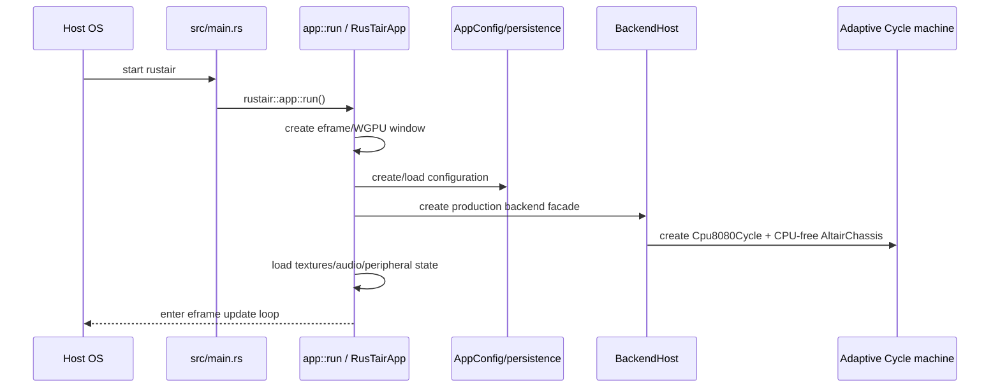
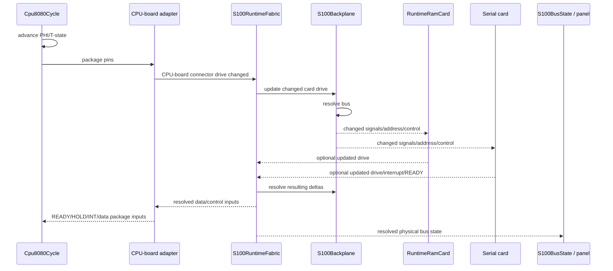
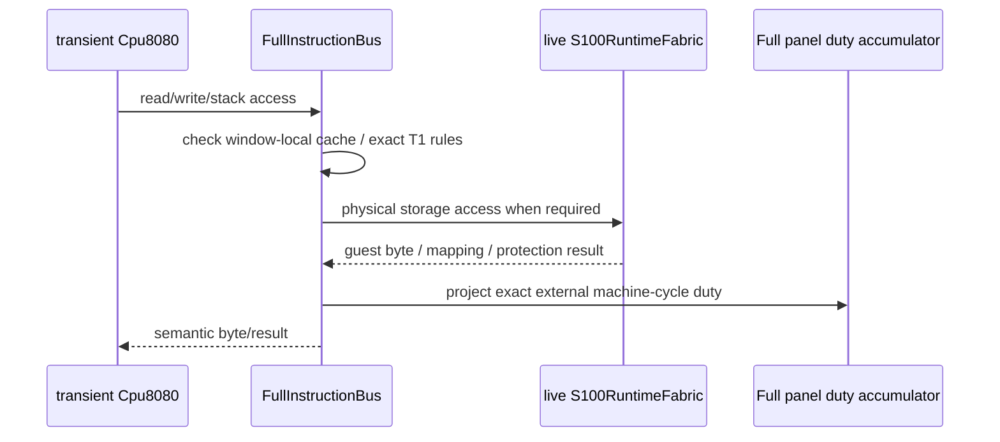
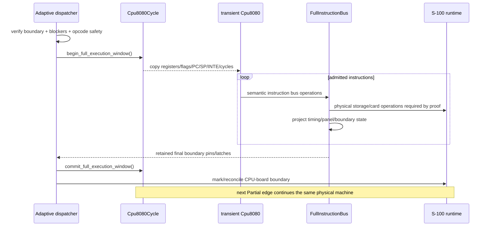
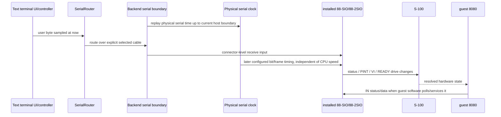
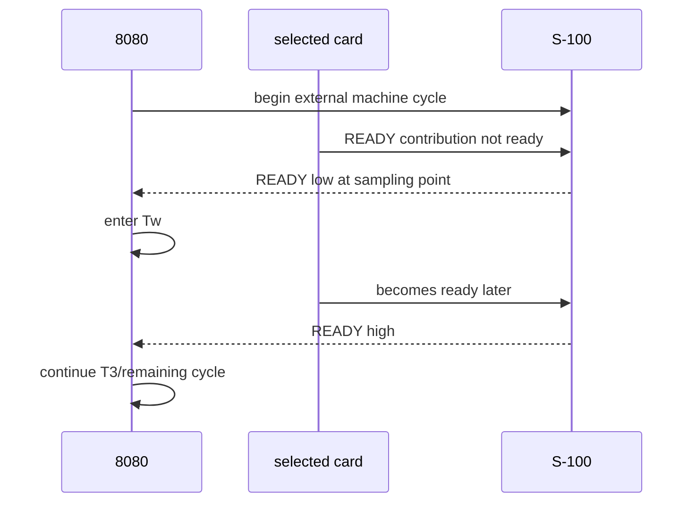
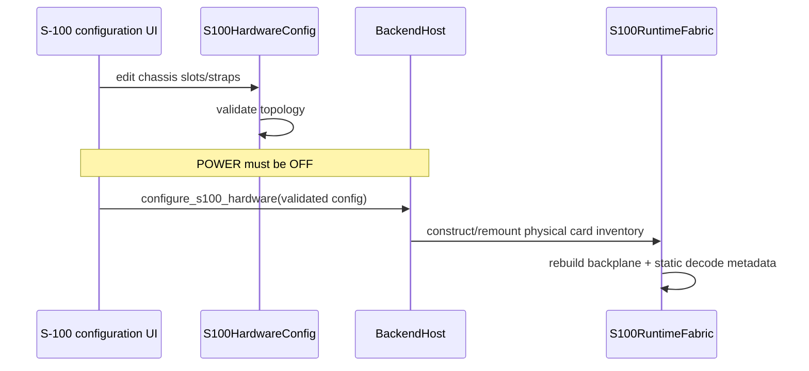

# RusTair Runtime Flows

This document follows common operations end to end. It complements the architectural layer view by answering **"what actually happens when... ?"**

---

## 1. Application startup



The app does not deserialize a live CPU/RAM/UART snapshot. It restores desired configuration and mounts valid physical hardware into one live machine.

---

## 2. One GUI frame while the CPU is running

```mermaid
sequenceDiagram
    participant E as eframe
    participant A as RusTairApp::update
    participant C as ExecutionClock
    participant F as run_cpu_frame
    participant B as BackendHost
    participant S as Installed serial card(s)
    participant M as Adaptive Cycle
    participant P as Peripheral/serial endpoints

    E->>A: update(now)
    A->>A: sync persisted/config/diagnostic state
    A->>B: select managed serial time for throttled CPU, Instant for Unlimited
    A->>C: budget(now, RUN, board clock, speed)
    C-->>A: allowed CPU T-states
    A->>F: replay CPU debt within host deadline
    loop throttled event-driven service
        F->>B: query serial_clock_deadline_t_states()
        B->>S: ask installed cards for earliest effective event
        S-->>B: None if quiet, or card-owned physical deadline
        B-->>F: deadline / no deadline
        F->>B: execute normal slice capped only by active deadline
        B->>M: execute Adaptive Full/Partial
        M-->>B: exact executed CPU T-state count
        F->>B: advance corresponding serial physical duration
        B->>S: advance installed UART oscillators only
    end
    F-->>A: total executed CPU T-states
    A->>C: record executed debt (throttled modes)
    A->>A: if CPU parked/stopped, advance serial physical time without fake CPU T-states
    A->>P: inject host input sampled at now; drain serial outputs/mechanics
    A->>E: render panels/tools, request next repaint
```

The repaint loop is not the UART clock. In Authentic/2×/5×/10×, `run_cpu_frame` uses the installed cards' next observable physical event rather than the retired fixed 4 µs slice.

A quiet serial channel publishes no scheduler deadline. If every installed UART is quiet, CPU execution retains the normal 4096-T-state Adaptive service slice and can stay in long Full windows. The card still retains its oscillator phase; `None` means only that no UART state can change before the normal CPU service boundary.

An active card publishes its next **effective** event. For 88-SIO that is the relevant COM2502 UART clock boundary. For 88-2SIO the external MITS 16× baud-generator tap continues to free-run and retain phase, while the scheduler observes the next divided MC6850 `/1`, `/16` or `/64` boundary rather than every intermediate tap pulse.

A guest `OUT` to installed serial hardware is a causal synchronization point. Adaptive execution stops before the output, the Cycle backend owns exact T-state progression across the barrier, pre-write serial physical time is settled, and the next scheduler query replans from the changed card state. A newly active UART therefore never receives time that elapsed before the guest actually wrote it.

Unlimited has no meaningful CPU-T-state-to-wall-time ratio. It remains constrained by a host-time deadline for responsiveness while the UART receives elapsed physical time directly from the backend's `Instant` source. Handoffs between managed throttled timing and Unlimited establish one boundary so elapsed serial time is neither dropped nor counted twice.

A card strapped/configured for 110 baud remains 110 baud in Authentic, 2×, 5×, 10× and Unlimited. Likewise, 9600 baud remains 9600 baud; increasing CPU execution speed only changes how much guest CPU work the host attempts during the same physical serial interval. Endpoint pacing is independent and must not silently restrap the card.

See [SERIAL_CLOCK_DOMAINS.md](SERIAL_CLOCK_DOMAINS.md) for the detailed clock-domain contract and benchmark evidence.

---

## 3. Exact instruction execution (Partial)

Simplified physical flow:



The implementation uses caching/delta observation, so not every conceptual arrow is necessarily an expensive host call on every phase. The physical dependency remains the same.

A CPU T-state no longer advances the 88-SIO/88-2SIO baud generator. It may advance hardware explicitly defined in CPU/chassis virtual time, such as the current DCDD mechanics epoch. Serial oscillator progress arrives through the independent physical-time scheduler and is then resolved through the same S-100 fabric.

---

## 4. Memory read in Partial

A typical memory read conceptually passes through:

```text
8080 memory-read machine cycle
→ CPU board drives address/status/control on S-100
→ predecoded responder mask identifies possible slots
→ selected RAM card observes bus
→ RAM card drives DI data lines
→ backplane resolves data bus
→ CPU board/8080 sample input data
→ front panel sees the corresponding physical bus cycle
```

Important details:

- zero responders means open/unmapped behavior;
- more than one responder is retained as an overlap and can contend;
- READY/wait timing belongs to the physical card/path;
- protection affects writes, not a separate synthetic memory map;
- debugger inspection may read the same card storage without pretending a guest transaction occurred.

---

## 5. Memory access in Full

Full does not use a separate RAM array.



The cache is an optimization over the same physical state. Writes/invalidation and special T1/high-Z cases ensure it does not become a hidden memory authority.

---

## 6. Full window lifecycle



No RAM or serial card is cloned at entry. An active independently clocked UART is not itself a reason to pin CPU execution in Partial. The scheduler caps CPU work only at card-owned observable serial deadlines, and guest serial IN/OUT remains an exact synchronization barrier. If a serial `OUT` would activate or reconfigure a UART, the managed causal barrier returns to exact Cycle progression before that card mutation and scheduling is replanned immediately afterward.

---

## 7. I/O read/write to 88-SIO / 88-2SIO

```text
8080 IN/OUT instruction
→ I/O machine cycle exposes A0..A7 / status / control
→ S100IoDecodeIndex yields possible physical responders
→ selected serial card adapter performs its normal electrical transaction
→ card/UART state changes or drives data/status
→ interrupt/READY/status lines resolve on S-100
→ CPU sees result
```

The decode index is equivalent to precompiling fixed jumper logic. It does not directly read/write the UART behind the card's back.

A managed serial `OUT` additionally acts as a host scheduling barrier so the card mutation occurs at the correct point on the physical serial timeline. This changes host work granularity, not the guest-visible I/O transaction.

---

## 8. Serial byte from host to guest

Example: a character typed in the text terminal.



A host byte is not deposited instantly into accumulator A. It becomes input to the installed serial hardware and guest software must interact with that hardware. The app first replays the physical interval that ended at the current host boundary and only then injects keyboard/tape input sampled during the current update. A newly arrived byte therefore cannot inherit UART time that elapsed before the byte existed.

The same rule applies to ASR-33 keyboard input, Text Terminal input, TCP and COM endpoints. They do not receive separate UART timing implementations.

---

## 9. Guest byte to ASR-33

```text
8080 OUT / serial-card transmit register
→ installed UART shifts the configured serial frame in physical serial time
→ completed byte reaches the emulated serial connector
→ explicit SerialRouter cable
→ ASR-33 peripheral/controller
→ ASR-33 mechanical printer/distributor pacing
→ ASR-33 UI/audio presentation
```

The ASR-33 visual/mechanical model is downstream of serial hardware; it is not part of the S-100 card. Its 10-cps mechanics may retain/pace completed output, but it does not complete COM2502/MC6850 transmission and it does not replace the selected card baud. At matching 110-baud settings the two physical stages pipeline rather than making CPU execution speed part of the line rate.

ASR/terminal endpoint timing and card baud remain independently configurable. RusTair must not auto-synchronize them behind the user's back.

---

## 10. CPU interrupt request

Conceptually:

```text
card internal condition
→ configured card interrupt output (PINT or VI line)
→ S-100 backplane resolution
→ CPU-board interrupt path
→ Cpu8080Cycle samples request at valid point
→ if INTE/rules allow: interrupt acknowledge cycle
```

Full admission must not skip across a pending asynchronous event that the exact CPU would observe. The conservative EI handling is built around this requirement.

---

## 11. READY / wait state



Moving this to "add N cycles after the instruction" would preserve a total but lose the physical timeline.

---

## 12. HOLD / HLDA

```text
external/card HOLD request
→ S-100 HOLD line
→ CPU-board/8080 samples HOLD at allowed boundary
→ CPU enters hold state
→ HLDA asserted / bus released
→ other bus owner may act (as implemented in future hardware)
→ HOLD released
→ CPU resumes at retained exact phase/state
```

Even where no current DMA master is installed, the CPU/front-panel/bus behavior is tested as a physical contract. A parked CPU does not freeze the independent serial oscillator; the GUI/backend scheduler advances physical serial time for the elapsed wall interval without fabricating CPU T-states.

---

## 13. Front-panel EXAMINE / DEPOSIT

These are not debugger peeks/pokes.

Conceptually:

- operator sets address/data switches;
- front-panel control logic takes/uses the system bus according to the modeled operation;
- EXAMINE reads physical memory through the machine/bus path;
- DEPOSIT performs a physical memory write subject to relevant board/protection rules;
- bus ADDRESS/DATA/STATUS and lamps correspond to that operation.

A debugger memory viewer can have a separate host-inspection mutation API because its semantics are explicitly "debugger edit", not "operator pressed DEPOSIT".

---

## 14. POWER OFF hardware reconfiguration



Live card state is replaced because this represents physically removing/installing hardware while power is off.

---

## 15. Quick load versus authentic paper-tape load

### Quick load

```text
user selects convenience load
→ app/backend controlled memory load
→ bytes written into physical RAM storage
→ CPU/panel state prepared according to the explicit convenience workflow
```

### Authentic load

```text
historical bootstrap runs on 8080
→ paper-tape reader produces serial input over physical peripheral time
→ installed serial card receives and shifts it at the configured baud
→ guest bootstrap polls/reads card
→ guest program writes bytes to RAM
```

Both can result in the same program in RAM, but they intentionally exercise very different hardware paths.

---

## 16. Debugger snapshot flow

```text
live machine
→ backend captures neutral snapshot/trace entry
→ optional decoder/explanation/call-stack/loop analysis
→ UI renders it
```

If the machine continues, the snapshot may become stale. That is acceptable. The UI should label/history it appropriately rather than mutating the old snapshot.

---

## 17. Persistence load

```text
settings file
→ parser + legacy migration
→ current AppConfig / S100HardwareConfig
→ validation
→ while POWER OFF: mount one live S100RuntimeFabric
```

Legacy fields are migration inputs only. They must not continue as a second live memory/card configuration.

---

## 18. Where to instrument a problem

- Need exact CPU edge? Instrument/test `cpu8080_cycle`/Partial.
- Need resolved bus? Inspect `S100BusSample`/backplane state.
- Need card-local state? Use the card's controlled runtime handle/test helper.
- Need serial timing? Inspect the card-owned deadline/phase plus `execution_frame`/`cycle_host` handoff; do not infer baud from CPU T-state rate.
- Need guest instruction history? Use `trace8080`.
- Need host serial data? Use endpoint/network/COM trace.
- Need Full coverage? Use `adaptive_metrics`.
- Need UI presentation? Inspect the derived snapshot, not live hardware internals.

Always choose the lowest layer that actually owns the questioned behavior.
