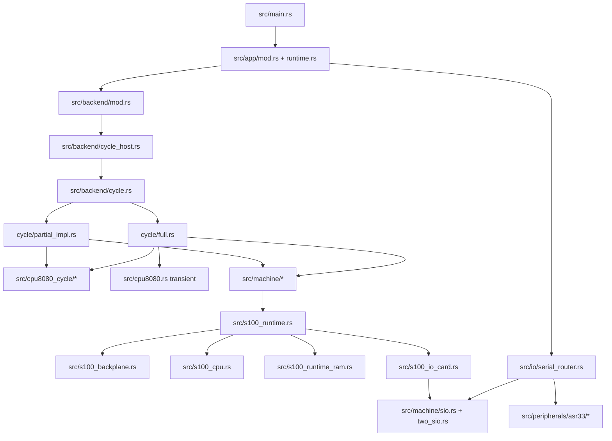

# RusTair Source Reference

This is the file-by-file map of the current Rust source tree. It is intended to answer two questions quickly:

1. **What does this file do?**
2. **If I change it, what physical/software invariant should I think about?**

The descriptions below document the current production architecture. Test-only files under `src/` are included because they encode important invariants.

> Rule of thumb: start from the subsystem you want to change, then read its implementation **and** the tests/docs that define its contract.

---

## 1. Crate entry points and cross-cutting source files

| File | Mission and characteristics |
| --- | --- |
| `src/main.rs` | Desktop executable entry point. It does almost nothing except call `rustair::app::run()`. Keep startup policy in the app module rather than growing this file. |
| `src/lib.rs` | Library/module root. Declares the public module graph and crate-private infrastructure such as embedded assets, Full boundary reconciliation and MC6850 support. Also preserves the historical `teletype` alias for `peripherals::asr33`. |
| `src/adaptive_metrics.rs` | Opt-in Adaptive Cycle instrumentation. Counts Full/Partial T-states, windows, transitions and fallback reasons. Uses thread-local state so normal execution pays no observer cost when measurement is disabled. Metrics are observational only and must never drive execution decisions. |
| `src/audio.rs` | Host audio engine using `rodio`. Plays embedded one-shot/looping sounds for the Altair/ASR-33. Audio-device failure is intentionally non-fatal so CI/headless use still works. Presentation only; never emulation authority. |
| `src/cpu8080.rs` | Instruction-level Intel 8080 semantic executor. Implements registers, flags, instruction semantics, stack and a generic `Bus` trait. In current production it is used transiently inside admitted Full windows and as a semantic/reference core; it is not a second persistent Altair CPU. |
| `src/decoder8080.rs` | Stateless 8080 decoder/disassembler metadata: mnemonic, operands, length, timing, conditions, control-flow classification, memory/I/O effects. Used by debugger/teaching tools, not as the hardware execution authority. |
| `src/explain8080.rs` | Human-readable instruction explanations for teaching/debugger UI. Combines decoded metadata with CPU/memory context. Derived interpretation only. |
| `src/debugger8080.rs` | Higher-level debugger analysis helpers, notably safe decoding around a PC and conservative simple backward-loop detection. Designed to avoid claiming code/control flow it cannot prove. |
| `src/debugger_control.rs` | Debug execution policy: execute breakpoints, memory watchpoints, run-to targets, step-over/out support and stop reasons. The controls request stops through the backend; they are not a second CPU scheduler. |
| `src/callstack8080.rs` | Infers a call stack from retained instruction history by observing CALL/RST/RET behavior and SP/PC transitions. Explicitly marks gaps/incomplete history. Never treated as architectural CPU state. |
| `src/trace8080.rs` | Instruction/effect trace data model and bounded history infrastructure used by debugger/history/call-stack tools. Captures observations of execution, not a shadow CPU. |
| `src/memory_activity8080.rs` | Derives/retains memory-access activity for debugging/visualization from execution observations. Presentation/analysis layer; authoritative bytes remain in physical RAM cards. |
| `src/embedded_assets.rs` | Central compile-time asset lookup for bundled binaries, artwork/audio/fonts and other embedded resources. Keeps callers independent of filesystem layout for built-in assets. |
| `src/full_boundary_reconcile.rs` | Zero-emulated-time host-side reconciliation when Full rejoins the live S-100 CPU-board fabric. Imports retained CPU-board latch/phase state without exposing fake intermediate connector transitions. Critical Full→Partial fidelity boundary. |
| `src/mc6850.rs` | Motorola MC6850 ACIA model used by the 88-2SIO implementation. Owns chip-level UART register/status/transmit/receive behavior; board straps/wiring live in higher board/config layers. |
| `src/s100_cycle_integration_tests.rs` | Crate-internal integration tests that exercise CPU-cycle/S-100 interactions using private internals. Test-only architectural evidence. |

---

## 2. `src/app/` — desktop application and workflow orchestration

The app layer owns UI/application state and asks the backend to operate the machine. It must not contain a second CPU, RAM or UART.

| File | Mission and characteristics |
| --- | --- |
| `src/app/mod.rs` | App module root and `RusTairApp` definition. Creates the eframe/WGPU window, owns host/application state (config, `BackendHost`, serial router, terminal/ASR controllers, audio, execution clock, UI assets) and defines shared constants/helpers. This is the composition root of the desktop application. |
| `src/app/runtime.rs` | Implements `eframe::App::update`. Per GUI frame it loads/synchronizes configuration, computes execution budget, runs the backend, services serial/peripheral workflows and renders top-level menus/windows. Important boundary between wall-clock/UI time and emulated time. |
| `src/app/execution_clock.rs` | Converts host elapsed time into guest T-state credit/debt for Authentic/5×/10× modes. Keeps guest board clock concept separate from host execution speed. |
| `src/app/execution_frame.rs` | Executes a backend budget in responsive chunks/deadlines. Contains the Unlimited scheduling policy that avoids repaint-rate throughput caps while preserving UI responsiveness. |
| `src/app/commands.rs` | Application-level user commands/actions that coordinate backend and UI state. Keeps command workflows out of drawing code. |
| `src/app/persistence.rs` | Saves/loads application and machine configuration and handles compatibility/migration from historical formats. Migration inputs must converge on one current slot-native S-100 configuration, not create a parallel runtime topology. |
| `src/app/authentic_loader.rs` | State/workflow for historically authentic loading, especially paper-tape/BASIC bootstrap paths. Distinct from direct RAM loading; coordinates real emulated serial/peripheral execution. |
| `src/app/cpu_diagnostics.rs` | External/classic CPU diagnostic workflow and file-dialog/run handling. Coordinates diagnostic loading/execution/reporting through the production machine. |
| `src/app/embedded_cpu_diagnostics.rs` | UI/application state for bundled diagnostic programs embedded in the executable. Keeps built-in diagnostic selection/run workflow separate from general external files. |
| `src/app/asr33_controller.rs` | Application/controller logic connecting the ASR-33 peripheral model to serial routing, timing, input/output and UI events. Does not replace the emulated serial card. |
| `src/app/asr33_state.rs` | Host/UI state associated with ASR-33 presentation/workflow (timers, transient interaction state, etc.). Separate from the physical teletype model in `peripherals/asr33`. |
| `src/app/terminal_controller.rs` | Application logic for text-terminal behavior and interaction with connected serial ports. |
| `src/app/terminal_serial.rs` | Serial transfer/pacing integration for the text terminal: moves data between terminal controller state and the selected emulated connection without owning UART state. |
| `src/app/terminal_state.rs` | Text-terminal application/presentation state, buffers and timing/preferences used by the controller/UI. |
| `src/app/serial_hardware.rs` | App-level coordination between configured S-100 serial hardware, available backend ports and endpoint/cable choices. Useful starting point for serial wiring UI behavior. |
| `src/app/external_serial.rs` | Host network/external serial endpoint state and servicing (TCP-oriented path) integrated with app lifecycle and serial routing. |
| `src/app/external_com.rs` | Host physical COM-port endpoint state/configuration/servicing. Uses host serial transport while guest UART/card semantics remain in the machine. |

### `src/app/ui/` — egui presentation and developer tools

These files draw or operate UI tools. They should consume backend snapshots/contracts rather than reaching into live hardware internals directly.

| File | Mission and characteristics |
| --- | --- |
| `src/app/ui/mod.rs` | UI module root. Declares/re-exports the individual windows/panels and shared UI helpers. |
| `src/app/ui/assets.rs` | Loads egui textures/fonts and other visual assets used by the application. Presentation only. |
| `src/app/ui/front_panel.rs` | Main photographic Altair front-panel rendering: lamps, panel layout and user interaction hooks. Raw lamp/control truth comes from backend/machine snapshots. |
| `src/app/ui/front_panel_assets.rs` | Front-panel artwork/texture/layout asset helpers. Keeps image selection/asset details out of panel logic. |
| `src/app/ui/front_panel_switches.rs` | Geometry/input/rendering helpers for front-panel switches. Converts user gestures into explicit panel control requests. |
| `src/app/ui/front_panel_operator.rs` | Standalone operator-oriented panel/control window and workflows. Should use the same backend controls as the main panel. |
| `src/app/ui/cpu_pin_diagram.rs` | Didactic visualization of Intel 8080 package pins/current CPU state. Reads captured backend state; does not drive pins. |
| `src/app/ui/bus_teacher.rs` | T-state/S-100 teaching UI presenting machine-cycle, bus and control-line snapshots with explanatory context. Historical snapshots are observations, not current machine state. |
| `src/app/ui/debugger_controls.rs` | Breakpoint/watchpoint/run-to/step controls and debugger command UI backed by `debugger_control`/backend APIs. |
| `src/app/ui/execution_position.rs` | Small helpers for determining/presenting current execution location in debugger views, including the distinction between exact cycle position and instruction-level display. |
| `src/app/ui/instruction_history.rs` | Instruction history/disassembly view built from retained trace entries. May show bounded/incomplete history; never a source of execution state. |
| `src/app/ui/loop_inspector.rs` | UI for conservative loop analysis produced by `debugger8080` helpers. |
| `src/app/ui/memory_activity.rs` | Visualizes recent memory activity/reads/writes derived from trace/activity observers. |
| `src/app/ui/memory_viewer.rs` | RAM/memory inspection and debugger-oriented mutation UI. Must inspect/mutate the same mounted physical RAM storage through backend APIs, not a copied memory image. |
| `src/app/ui/s100_memory_inspection.rs` | S-100-specific memory inspection presentation: responders, overlaps, protection/card ownership details. Useful for diagnosing decode/physical RAM topology. |
| `src/app/ui/s100_hardware.rs` | Physical chassis/card configuration UI. Slot changes are validated and require POWER OFF because this represents real card installation/straps. |
| `src/app/ui/io_inspector.rs` | Displays guest I/O and host serial/network trace observations for troubleshooting serial/card traffic. Opening the inspector may enable capture but must not alter guest semantics. |
| `src/app/ui/asr33.rs` | ASR-33 drawing and interaction helpers for the integrated teletype presentation. |
| `src/app/ui/asr33_window.rs` | ASR-33 dedicated window/layout and operator controls. |
| `src/app/ui/terminal.rs` | Text terminal window and interaction rendering. Terminal buffers/presentation are host-side; UART state remains in installed card hardware. |

---

## 3. `src/backend/` — app-facing machine contract and Adaptive execution

| File | Mission and characteristics |
| --- | --- |
| `src/backend/mod.rs` | Public machine abstraction/facade. Defines the single engine identity, capabilities, neutral CPU/front-panel snapshots, serial-line data, errors, `MachineBackend` contract and `BackendHost`-facing API surface. UI code should prefer this contract over concrete hardware internals. |
| `src/backend/cycle_host.rs` | Host/scheduling/debugger facade around the concrete Adaptive Cycle backend. Owns host-facing policy such as service execution, idle/serial time bridging and debugger integration; must not duplicate machine state. |
| `src/backend/bus_teaching.rs` | Converts exact machine/backend observations into stable didactic bus-teaching snapshots/types (machine cycle, T-state, CPU pins, status/control lines, accuracy labels). Observer only. |
| `src/backend/cycle.rs` | Small dispatcher/composition module for the concrete backend. Includes the exact Partial implementation, adds Full, and exposes physical S-100 reconfiguration with POWER-OFF guard. |
| `src/backend/cycle/partial_impl.rs` | The large authoritative exact backend implementation: edge/T-state execution through CPU board and S-100, machine lifecycle/control operations, backend trait implementation, debugger hooks and physical synchronization. Treat as the physical oracle when reviewing Full changes. |
| `src/backend/cycle/full.rs` | Adaptive Full engine and `FullInstructionBus`. Contains opcode admission, safety blockers, guest read/write caches, physical T1 handling, panel-duty accounting, protection, DI/EI/control-flow exactness, multi-instruction windows, boundary reconstruction and Full→Partial state handoff. Performance-sensitive and fidelity-sensitive. |
| `src/backend/cycle/full/control_flow_tests.rs` | Full-versus-exact oracles for CALL/RET/RST/conditional control-flow timing, internal T5 placement and boundary state. Do not weaken when extending Full control flow. |
| `src/backend/cycle/full/ei_tests.rs` | Exact tests for conservative Full EI handling, delayed INTE transition, EI→LHLD guarded admission, pending interrupt behavior and EI/DI cancellation. |
| `src/backend/cycle/full/panel_histogram_reference.rs` | Independent/reference front-panel duty implementation used to verify the optimized marginal accumulator. It is intentionally not the production fast representation; it is an oracle against optimization mistakes. |

`src/backend/README.md` is not Rust source, but it is the current backend ownership contract and should be read before editing this directory.

---

## 4. `src/cpu8080_cycle/` — exact Intel 8080 timing core

This directory contains the stateful exact CPU. `Cpu8080Cycle` is the architectural authority at synchronization boundaries.

| File | Mission and characteristics |
| --- | --- |
| `src/cpu8080_cycle/mod.rs` | Core `Cpu8080Cycle` type and main state-machine/tick behavior. Stores registers, pins, current machine cycle/T-state, instruction temporaries, INTE/EI, HALT/HOLD/reset/fault and exact counters. Also declares child modules and exposes trace/timing types. |
| `src/cpu8080_cycle/alu.rs` | ALU/flag operations used by the exact core. Encodes Intel 8080 flag semantics (including Auxiliary Carry details) separately from timing/control sequencing. |
| `src/cpu8080_cycle/decode.rs` | Internal decode from opcode to the exact core's `Instruction`/register/control representation. This is execution-oriented decode, distinct from the richer UI/disassembler metadata in top-level `decoder8080.rs`. |
| `src/cpu8080_cycle/control_flow.rs` | Exact-core control-flow helpers/schedules for jumps, calls, returns, restarts and related PC/SP behavior. |
| `src/cpu8080_cycle/pins.rs` | Intel 8080 input/output package pin structures used to exchange digital state with the CPU-board layer. |
| `src/cpu8080_cycle/state.rs` | Register/state helpers plus Full boundary import/export. `begin_full_execution_window` exports a clean boundary to transient `Cpu8080`; `commit_full_execution_window` restores completed semantic state to the exact core and restarts the exact fetch boundary. |
| `src/cpu8080_cycle/timing.rs` | Defines machine-cycle classes, Intel status words, T-states (`T1/T2/Tw/T3/T4/T5/Thalt/Thold`) and digital clock-edge vocabulary (`PHI1/PHI2`). |
| `src/cpu8080_cycle/timing/phase.rs` | Edge-level PHI1/PHI2 transition logic and per-phase sequencing beneath whole-T-state stepping. Critical when a signal changes/samples within a T-state. |

### Exact-core test modules under `src/cpu8080_cycle/`

| File | What it proves |
| --- | --- |
| `src/cpu8080_cycle/alu_tests.rs` | Intel 8080 ALU results and flags. |
| `src/cpu8080_cycle/call_return_tests.rs` | CALL/RET/RST stack/PC behavior and timing details. |
| `src/cpu8080_cycle/control_flow_tests.rs` | Jump/conditional/control-flow exact behavior. |
| `src/cpu8080_cycle/core_tests.rs` | Core instruction/tick/reset/general invariants. |
| `src/cpu8080_cycle/hold_tests.rs` | HOLD/HLDA entry, bus release, dwell and resume behavior. |
| `src/cpu8080_cycle/interrupt_control_tests.rs` | Interrupt request/enable/acknowledge and DI/EI timing behavior. |
| `src/cpu8080_cycle/io_tests.rs` | Exact IN/OUT machine cycles and I/O-facing pin/timing behavior. |
| `src/cpu8080_cycle/special_transfer_tests.rs` | Special multi-cycle transfer instructions whose bus/timing patterns need dedicated verification. |

---

## 5. `src/machine/` — Altair chassis, front-panel and serial integration

This layer connects the exact CPU and generic S-100 runtime into an Altair machine. It is intentionally CPU-independent at the chassis state level: no second processor lives here.

| File | Mission and characteristics |
| --- | --- |
| `src/machine/mod.rs` | Machine module root and `AltairBus` composition. Owns machine memory facade, front-panel controller, canonical S-100 bus state and diagnostic metering. Exposes selected machine types/constants to backend. No hidden UART or alternate RAM. |
| `src/machine/chassis.rs` | `AltairChassis`: physical chassis lifecycle/control wrapper (power, panel/control interaction and CPU-free machine container). RUN state derives from physical bus latch rather than a duplicate boolean authority. |
| `src/machine/cpu_board.rs` | Adapter between `Cpu8080Cycle` package pins/control inputs and the MITS 8080 S-100 CPU-board electrical behavior. Defines CPU samples/control-line views used by exact backend. |
| `src/machine/front_panel.rs` | `FrontPanelController` and switch/control-side panel state such as address/data switch handling. Physical operations are later projected onto the bus/chassis; this is not the GUI renderer. |
| `src/machine/panel_bus.rs` | Canonical `S100BusState`, raw panel-visible signal/status state, panel lamp snapshots/integration and optimized Full panel-duty accumulation. Central front-panel fidelity file. Raw state is authoritative; brightness is derived. |
| `src/machine/memory.rs` | Machine-facing memory facade over the live `S100RuntimeFabric`: configuration/migration helpers, physical RAM inspection/load/protection, guest reads/writes and serial-time forwarding. Must not become a second memory store. |
| `src/machine/serial.rs` | Historical 88-SIO-facing types/logic exposed through the machine module, including revision-specific serial behavior and shared serial abstractions. |
| `src/machine/serial_bus.rs` | Internal serial connector/bus representation for transferring electrical/logical serial signals between card model and attached endpoint layer. |
| `src/machine/serial_card.rs` | Runtime serial-card handle/device boundary used by `S100RuntimeFabric` and host inspection/endpoints. Keeps one guest-visible UART/card instance while allowing controlled host access. |
| `src/machine/serial_devices.rs` | Installed serial device/card implementations and compatibility routing facade. Hosts the card-family behavior used by runtime serial card adapters, including common trace/activity handling. |
| `src/machine/sio.rs` | MITS 88-SIO implementation: UART/card state, revisions, data/status port semantics, timing/handshake/interrupt behavior and physical interface rules. |
| `src/machine/sio_interface.rs` | 88-SIO electrical interface conversion/connector rules (RS-232/TTL/TTY-style variants and handshake signal mapping). Keeps external electrical interface semantics separate from core UART registers. |
| `src/machine/two_sio.rs` | MITS 88-2SIO/MC6850 board implementation: two ports, baud-generator taps, strap effects, status/control/data paths and interrupt wiring. Uses `mc6850.rs` for ACIA chip behavior. |

---

## 6. S-100 files — physical bus, chassis and runtime cards

| File | Mission and characteristics |
| --- | --- |
| `src/s100.rs` | Fundamental historical S-100 vocabulary: modeled signals, pin mapping, connector contact roles, card descriptors/classes and common card contract types. This is the physical language shared by all cards. |
| `src/s100_interface.rs` | Canonical public/software view of a card connector. Re-exports the common card/backplane electrical interfaces and explicitly separates host inspection handles from guest bus transactions. |
| `src/s100_backplane.rs` | Card-agnostic electrical resolver. Stores installed card drives, resolves High-Z/strong/open-collector drivers and contention, tracks changed pins/cards, caches selected drives and uses compact bitsets/driver counts on the hot path. Must never contain CPU/RAM/serial family logic. |
| `src/s100_chassis.rs` | Historical chassis/motherboard topology: Altair 8800/8800a/8800b physical connector populations and validation. Creates empty usable backplanes; does not decide card identity. |
| `src/s100_runtime.rs` | Live physical fabric assembler and runtime authority for installed cards. Materializes `S100HardwareConfig` into CPU/RAM/serial card instances, owns the `S100Backplane`, static memory responder table, RAM slot index and I/O decode index, and performs electrical settling/optimized guest transactions. |
| `src/s100_cpu.rs` | Live MITS 8080 CPU-board S-100 card implementation/handle. Converts CPU package state into board-level S-100 drives/status-latch behavior while exposing controlled host reconciliation/inspection hooks. |
| `src/s100_memory.rs` | Historical RAM-board descriptions/configuration semantics used to represent real board address/population/timing/protection properties. Provides board-level validation separate from runtime byte storage. |
| `src/s100_runtime_ram.rs` | Live RAM card implementation and handle. Owns actual RAM bytes and runtime drive/decode/protection/wait behavior for installed RAM cards. This storage is the authoritative guest memory. |
| `src/s100_io.rs` | Precompiled I/O-port and interrupt-driver responder masks derived from fixed card straps. Acceleration metadata only: multiple responders remain represented and selected cards still execute normal electrical behavior. |
| `src/s100_io_card.rs` | S-100 electrical adapter for runtime serial/I/O cards. Connects machine serial-card behavior to generic S-100 I/O cycles/status/data/interrupt lines without teaching the backplane card-specific semantics. |

---

## 7. `src/config/` — validated desired hardware and application configuration

Configuration describes what should be mounted/connected. It is not a second copy of live emulated hardware.

| File | Mission and characteristics |
| --- | --- |
| `src/config/mod.rs` | Configuration module root/re-exports. Keeps app code importing stable config types rather than individual files. |
| `src/config/machine.rs` | Machine-level configuration and compatibility fields: RAM initialization, CPU/emulation preferences and migration-facing aggregate settings. Current physical inventory ultimately lives in `s100_hardware`. |
| `src/config/s100_hardware.rs` | Slot-native physical S-100 inventory, installed-card enum, validation, RAM/card queries and CPU-board selection. Central desired-topology model. |
| `src/config/s100_codec.rs` | Serialization/parsing codec for slot-native S-100 hardware configuration used by persistence/migration. Keeps textual persistence details separate from hardware types. |
| `src/config/sio.rs` | MITS 88-SIO configurable properties: address pair, revision/format/baud/interface/interrupt wiring and validation/defaults. |
| `src/config/sio_electrical.rs` | Small shared electrical-interface configuration types for serial hardware, separating physical signaling choices from runtime device state. |
| `src/config/two_sio.rs` | MITS 88-2SIO strap/address/baud/interrupt configuration and validation. Represents physical jumpers/straps rather than live MC6850 registers. |
| `src/config/external_serial.rs` | Persisted/settings model for external network/TCP serial endpoint behavior. Host transport configuration, not guest UART state. |
| `src/config/external_com.rs` | Persisted/settings model for host COM serial endpoint behavior. |
| `src/config/terminal.rs` | Text-terminal configuration/pacing-related user settings. |

---

## 8. `src/io/` — host transports and cable routing

| File | Mission and characteristics |
| --- | --- |
| `src/io/mod.rs` | I/O transport module root/re-exports. |
| `src/io/serial_router.rs` | Explicit cable/router model connecting host/peripheral endpoint identities to available emulated serial ports. Enforces connection/disconnection semantics instead of invisible auto-wiring. |
| `src/io/tcp_serial.rs` | Host TCP serial transport/server implementation, buffering and network trace behavior. It carries endpoint data; it does not emulate UART registers. |
| `src/io/com_serial.rs` | Host physical COM-port transport using `serialport`, including host-port open/config/read/write/control-line behavior and trace support. Separate from the 88-SIO/88-2SIO hardware model. |

---

## 9. `src/peripherals/asr33/` — ASR-33 teletype model

The ASR-33 is an external peripheral connected to serial hardware, not an S-100 card.

| File | Mission and characteristics |
| --- | --- |
| `src/peripherals/mod.rs` | Peripheral module root. Currently exposes the ASR-33 model. |
| `src/peripherals/asr33/mod.rs` | ASR-33 module root/re-exports for model, keyboard, tape, mechanics and answerback functionality. |
| `src/peripherals/asr33/model.rs` | Core teletype model/state: printing/input behavior and central peripheral coordination independent of egui. |
| `src/peripherals/asr33/keyboard.rs` | ASR-33 keyboard key definitions/mapping and encoding behavior. |
| `src/peripherals/asr33/paper_tape.rs` | Paper-tape reader/punch data model and transport behavior used by authentic loading and teletype workflows. |
| `src/peripherals/asr33/answerback.rs` | ASR-33 answerback mechanism/state and generated character sequence behavior. |
| `src/peripherals/asr33/mechanics.rs` | Mechanical timing/state helpers for carriage/paper/print actions represented by the peripheral model. |

The UI/controller side of the same peripheral lives in `src/app/asr33_*` and `src/app/ui/asr33*`.

---

## 10. How the major files relate

---

## 11. Files that are especially dangerous to change casually

These are not "do not touch" files, but they sit on critical fidelity/performance boundaries:

- `src/backend/cycle/partial_impl.rs` — exact physical oracle.
- `src/backend/cycle/full.rs` — optimized path must remain equivalent to Partial.
- `src/cpu8080_cycle/mod.rs`, `timing.rs`, `timing/phase.rs` — exact processor timing.
- `src/machine/panel_bus.rs` — raw bus/panel authority and Full duty accounting.
- `src/s100_backplane.rs` — electrical resolution for every card.
- `src/s100_runtime.rs` — live topology plus critical hot-path specialization.
- `src/s100_runtime_ram.rs` — authoritative guest RAM storage.
- `src/machine/sio.rs`, `two_sio.rs`, `mc6850.rs` — guest-visible serial timing/status/interrupt state.
- `src/full_boundary_reconcile.rs` — Full→Partial physical re-entry.
- `src/app/execution_clock.rs`, `execution_frame.rs` — host scheduling must not change modeled hardware time.

A change in one of these should normally come with focused fidelity tests, not only UI/manual validation.

---

## 12. Files whose state is intentionally derived

These are safer places to add diagnostics, provided they remain read-only observers of emulation truth:

- `decoder8080.rs`
- `explain8080.rs`
- `debugger8080.rs`
- `callstack8080.rs`
- `trace8080.rs`
- `memory_activity8080.rs`
- most `src/app/ui/*` viewers
- `backend/bus_teaching.rs`
- `adaptive_metrics.rs`

Derived does not mean unimportant: these tools can still confuse users or damage performance if poorly designed, but they must not become alternate hardware authorities.

---

## 13. Test source outside `src/`

The integration tests under `tests/` are numerous and intentionally organized by invariant rather than by production file. Important groups include:

- Adaptive/Full/Partial authority and metrics;
- classic 8080 diagnostics and differential execution;
- CPU-board clock/pin/timing behavior;
- READY/HOLD/interrupt/RESET fidelity;
- front-panel raw state and lamp duty;
- open-bus/memory wait/protection behavior;
- S-100 topology, decode, card authority and electrical drive behavior;
- 88-SIO/88-2SIO configuration, timing, interrupts and interfaces;
- serial endpoint/cabling/idle-time behavior;
- debugger/history/teaching UI architecture;
- authentic BASIC/paper-tape loading;
- performance/profiling tests (often intentionally ignored).

See [TESTING_GUIDE.md](TESTING_GUIDE.md) for how to select and run them.
